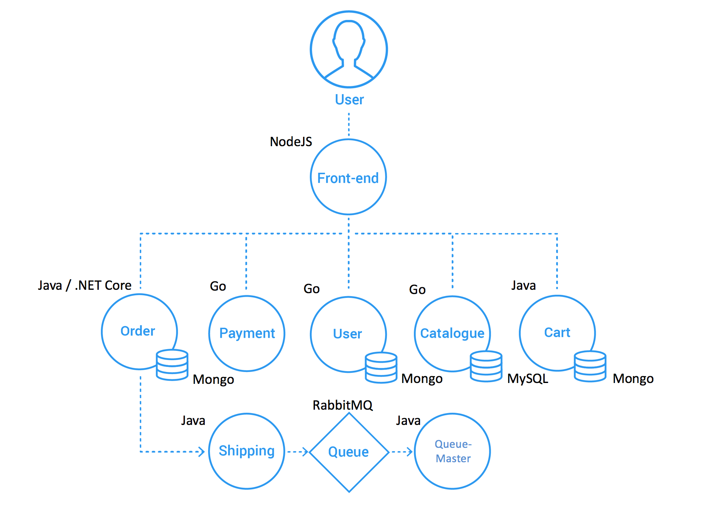
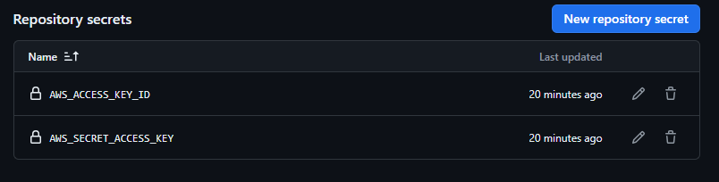
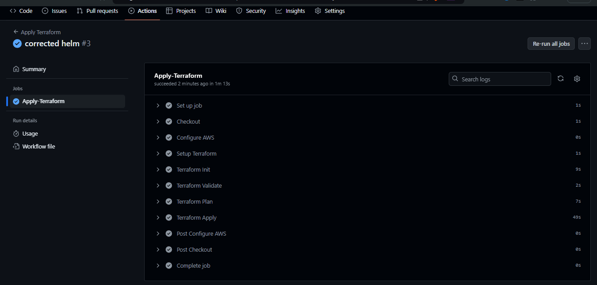
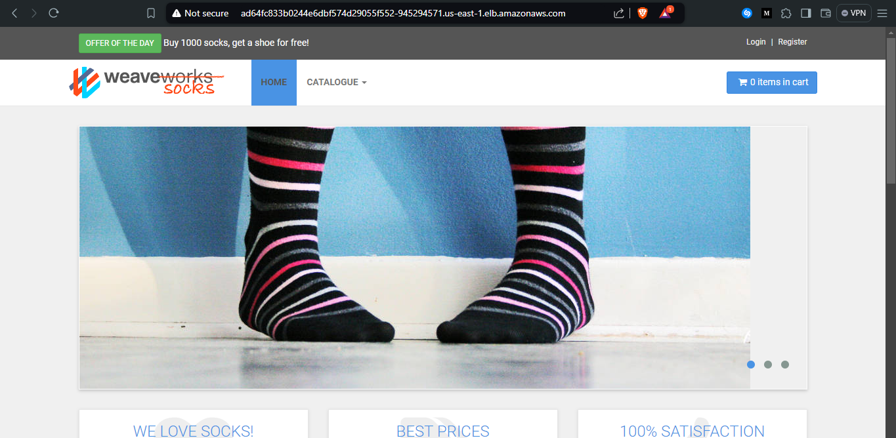
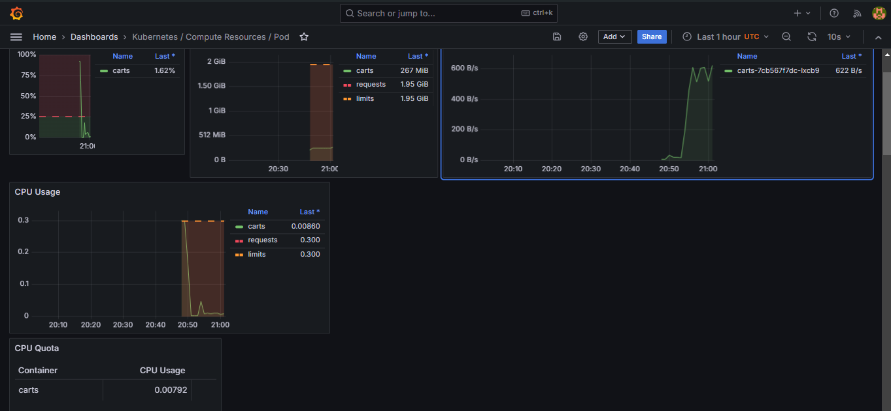
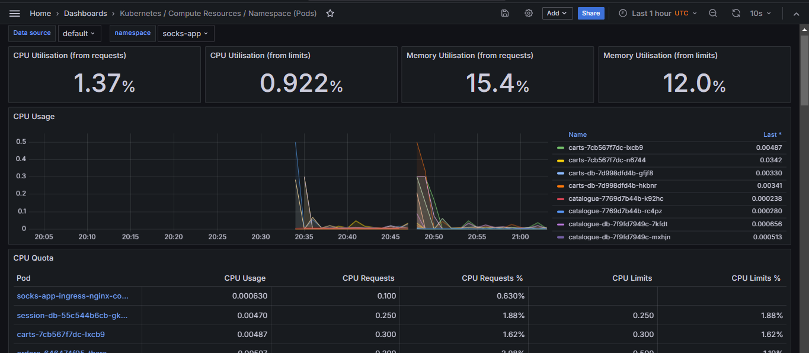
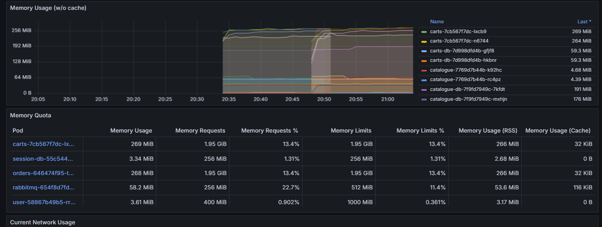
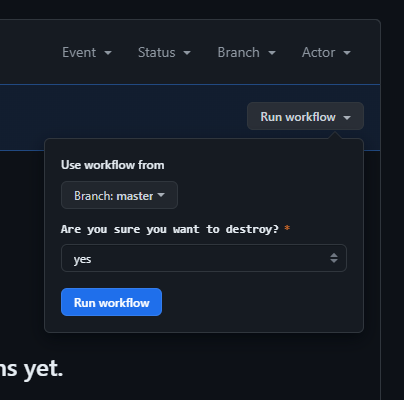
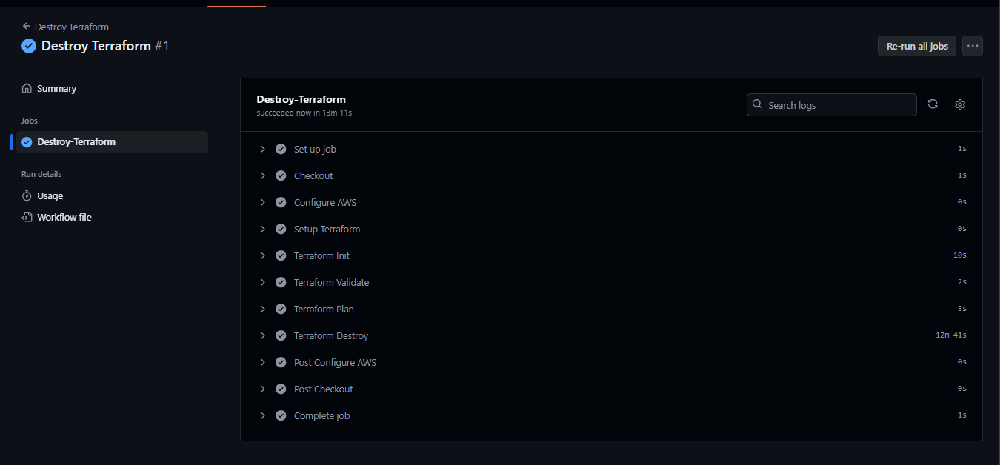

# Altschool Capstone Project

This repository deploys the socks application on AWS using AWS EKS cluster. IAC usng terraform is used to provision and set up all resources down from the network layer up till the infrastructure layer.

The application is a micro service application that includes a single frontend which is the entry point and multiple backend microservices that interacts with each other using gRPC connections. These microservices store data into different data stores  redis, MYSQL and mongodb based on it's use case.

It also includes queuing using rabbit mq.



## Archtecture
The repository sets up VPC with public and Private Subnets using terraform and proceed to create an EKS cluster. The application is then deployed using the provided helm chart in the `/helm-chart` folder of the repository. Terraform uses the helm provider to Install the chart on the EKS cluster once the cluster completes it's creation process.

## Monitoring
To set up monitoring on the cluster, the kube-prometheus stack helm chart is installed using terraform helm provider. This chart installs Prometheus, Grafana, Alert Manager and it also configures cadvisor and application monitoring dashboards based on namespaces.

## Spin Up the Infrastructure 
To spin up this infra, first ensure you have created bucket in s3 to  make sure terraform stores it's state file in that bucket. Proceed to enter the name of the bucket in the `main.tf` file under the terraform block

```
terraform {
  backend "s3" {
    bucket = "my-terraform-state-bucket20124"
    region = "us-east-2"
    key    = "altschool-capstone/terraform.tfstate"
  }
}

```

Once that is completed, set your secrets in github actions because the infrastructure will be provisioned using github actions. The secret should contain your AWS access keys credentials

```
AWS_ACCESS_KEY_ID
AWS_SECRET_ACCESS_KEY
```



Once these values are set, make any change to any file in the repository and push the change. It should trigger the pipeline that will set up the cluster and install the application on that cluster.



## Access The Micro-Service App
The application's helm chart install nginx ingress and the micro service stack on the cluster. The nginx ingress can be reached through the loadbalancer URL provided on creation. So to access it, on your local terminal that has aws cli authenticated, execute the command below:

```
aws eks update-kubeconfig --region us-east-1 --name socks-shop
```

Confirm that all pods are running

```
kubectl get pods -n socks-app
```

```
NAME                                                  READY   STATUS    RESTARTS   AGE
carts-7cb567f7dc-lxcb9                                0/1     Running   0          4m46s
carts-db-7d998dfd4b-hkbnr                             1/1     Running   0          4m46s
catalogue-7769d7b44b-k92hc                            1/1     Running   0          4m47s
catalogue-db-7f9fd7949c-7kfdt                         1/1     Running   0          4m47s
front-end-5dbc9c8d9b-gcvx8                            1/1     Running   0          4m47s
orders-646474f95-thsrs                                1/1     Running   0          4m47s
orders-db-6476fc6b6d-46rsc                            1/1     Running   0          4m47s
payment-75c6b944cd-c5vgm                              1/1     Running   0          4m47s
queue-master-856b98b476-hxmkq                         1/1     Running   0          4m47s
rabbitmq-654f8d7fdc-qcr28                             1/1     Running   0          4m47s
session-db-55c544b6cb-gk9m2                           1/1     Running   0          4m46s
shipping-68dfc9f8fd-4pqwb                             0/1     Running   0          4m47s
socks-app-ingress-nginx-controller-8594b6d649-wp6rt   1/1     Running   0          4m46s
user-58867b49b5-rrnl6                                 1/1     Running   0          4m46s
user-db-566f74665-xjw2j                               1/1     Running   0          4m47s
```
To get the loadbalancer link to access the application UI, execute the command below

```
kubectl get svc -n socks-app
```

```
NAME                                           TYPE           CLUSTER-IP       EXTERNAL-IP                                                              PORT(S)                      AGE
carts                                          ClusterIP      172.20.74.170    <none>                                                                   80/TCP                       6m13s
carts-db                                       ClusterIP      172.20.123.100   <none>                                                                   27017/TCP                    6m13s
catalogue                                      ClusterIP      172.20.72.30     <none>                                                                   80/TCP                       6m13s
catalogue-db                                   ClusterIP      172.20.123.116   <none>                                                                   3306/TCP                     6m13s
front-end                                      NodePort       172.20.135.0     <none>                                                                   80:30001/TCP                 6m13s
orders                                         ClusterIP      172.20.215.150   <none>                                                                   80/TCP                       6m13s
orders-db                                      ClusterIP      172.20.38.143    <none>                                                                   27017/TCP                    6m13s
payment                                        ClusterIP      172.20.159.103   <none>                                                                   80/TCP                       6m13s
queue-master                                   ClusterIP      172.20.102.247   <none>                                                                   80/TCP                       6m13s
rabbitmq                                       ClusterIP      172.20.81.213    <none>                                                                   5672/TCP                     6m13s
session-db                                     ClusterIP      172.20.250.145   <none>                                                                   6379/TCP                     6m13s
shipping                                       ClusterIP      172.20.167.116   <none>                                                                   80/TCP                       6m13s
socks-app-ingress-nginx-controller             LoadBalancer   172.20.179.26    ad64fc833b0244e6dbf574d29055f552-945294571.us-east-1.elb.amazonaws.com   80:31142/TCP,443:31875/TCP   6m13s
socks-app-ingress-nginx-controller-admission   ClusterIP      172.20.155.70    <none>                                                                   443/TCP                      6m13s
user                                           ClusterIP      172.20.108.196   <none>                                                                   80/TCP                       6m13s
user-db                                        ClusterIP      172.20.148.56    <none>                                                                   27017/TCP                    6m13s
```

Copy the loadbalancer URL from the SVC list and open it in your browser to access the application.



## Monitoring

To access the monitoring stack, first confirm that all prometheus, grafana and alert manager pods are running

```
 kubectl get pods -n kube-prometheus
```

```
NAME                                                     READY   STATUS    RESTARTS   AGE
alertmanager-kube-prometheus-kube-prome-alertmanager-0   2/2     Running   0          23m
kube-prometheus-grafana-77654cdd9-km4wf                  3/3     Running   0          23m
kube-prometheus-kube-prome-operator-7fb7d77b4f-k9bqk     1/1     Running   0          23m
kube-prometheus-kube-state-metrics-6cd54bbcd8-n8mwc      1/1     Running   0          23m
kube-prometheus-prometheus-node-exporter-6x4cc           1/1     Running   0          23m
kube-prometheus-prometheus-node-exporter-frb9m           1/1     Running   0          23m
kube-prometheus-prometheus-node-exporter-gbq5j           1/1     Running   0          23m
kube-prometheus-prometheus-node-exporter-qnhh6           1/1     Running   0          23m
kube-prometheus-prometheus-node-exporter-xzq92           1/1     Running   0          23m
prometheus-kube-prometheus-kube-prome-prometheus-0       2/2     Running   0          23m
```

You can now proceed to access grafana dashboard from your local machine using a port forward

```
 kubectl port-forward --namespace kube-prometheus svc/kube-prometheus-grafana 80  
```

login using `admin` as userame and `prom-operator` as password 

You can then process to view multiple dashboards to monitor pods







## Clean Ups

To Clean up and remove all resources from AWS, there's a destroy pipline that allows only manual trigger that will remove and clean up everything from AWS. In github actions, select `Destroy Terraform` and confirm yes.

To remove and clean up all resources.





